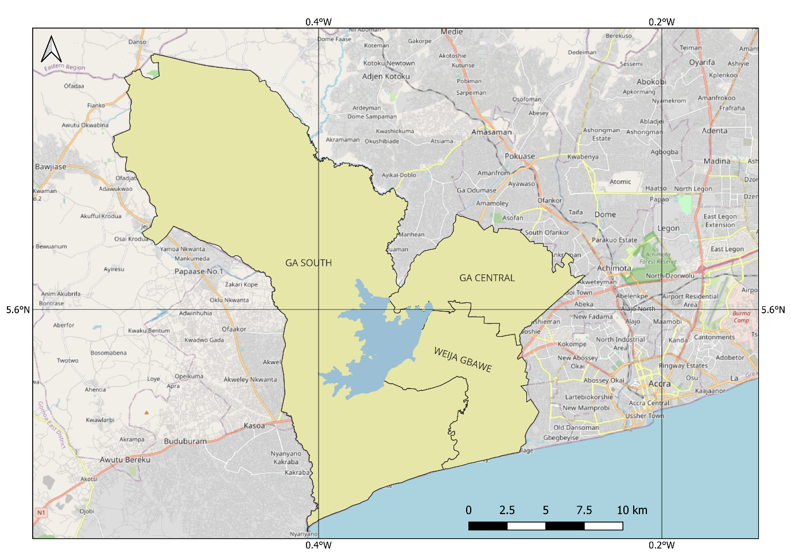
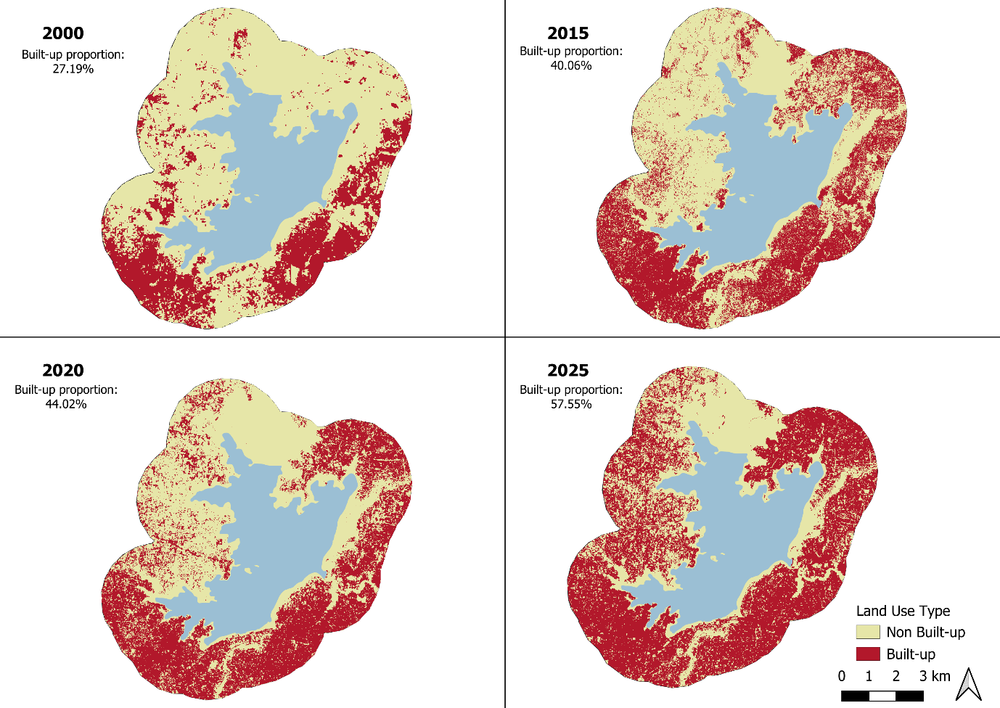

A selection of projects combining statistical modeling, geospatial analysis, NLP, and dashboard development — with a focus on WASH, environmental planning, and policy applications in Ghana and similar contexts.

::: {.grid} 

::: {.g-col-6 .card}
## 🧼 WASH Service Level Indicator Construction

**Tools:** R, dplyr, sf, purrr, janitor 

**Overview:** Cleaned and harmonized six national datasets (population, sanitation, waste, water access, etc.) to compute access indicators across 261 districts. Integrated spatial joins and regional metadata.

[R script](https://github.com/emmanueldogbey/cdd-wash-data) [Final dataset (CSV)](https://github.com/emmanueldogbey/cdd-wash-data/blob/main/output/cdd_data.csv)
:::

::: {.g-col-6 .card}
## ♻️ Predictive Modelling of Waste Collection Rates (2010–2021)

**Tools:** R, ggplot2, lm, sf

**Overview:** Built a linear regression model to estimate district-level solid waste collection rates from generation estimates and district types. Merged PHC datasets and visualized results using maps and residual plots.

[R script](https://github.com/emmanueldogbey/waste-collection-prediction)
:::

:::

::: {.grid}

::: {.g-col-12 .card}
## 🛰️ Built-up Change Detection around Weija Reservoir

**Tools:** Google Earth Engine, JavaScript, Landsat 7, Sentinel-2, Random Forest

**Overview:** Mapped settlement encroachment within a 2 km buffer of the Weija Reservoir, Ghana, from 2000 to 2025. The analysis uses a supervised binary classification to distinguish built-up from non-built-up land and quantify the pace of urban expansion around this critical water resource.

**Method:** Dry-season, cloud-masked composites were created from Landsat 7 (2000–2003) and Sentinel-2 (2015, 2020 and 2025) surface-reflectance imagery. Blue, green, red, NIR, SWIR1 and SWIR2 bands, together with NDVI, NDBI, MNDWI and BSI, were used to train separate 200-tree Random Forest models for each year. Training data were manually digitised in Google Earth Pro and split 70:30 for class-stratified training and validation.

**Key findings:** Overall model accuracy ranged from 85.9% to 92.6%. Built-up land (excluding the reservoir) increased from 27.19% in 2000 to 57.55% in 2025—an increase of 21.61 km² (111.69%).

::: {.grid}
::: {.g-col-5}
{.project-figure}
:::
::: {.g-col-7}
{.project-figure}
:::
:::

[Google Earth Engine script — 2025](https://code.earthengine.google.com/42111efb6d6e189d32f2e2f7db480931) [2020](https://code.earthengine.google.com/7afa4cb502f9c4e81b00c40562234f00) [2015](https://code.earthengine.google.com/add31043ec3b4e78e095e5fb18032cdb) [2000](https://code.earthengine.google.com/fdb11a3bb1596780049043fe341df398)
:::

:::

::: {.grid}

::: {.g-col-6 .card}
## 🌍 Sewage Facility Dashboard

**Tools:** R Shiny, leaflet, shinydashboard

**Overview:** Interactive tool visualizing sewage treatment facilities across Ghana by region, condition, and type. Includes dynamic maps and summary tables.

[Link to Dashboard](https://emmanueldogbey.shinyapps.io/sewage-facilities-dashboard/)
:::

::: {.g-col-6 .card}
## 🌐 StatsBank API Automation

**Tools:** R, httr2, jsonlite

**Overview:** Created a full workflow for querying Ghana Statistical Service’s StatsBank API. Handled JSON logic, error handling, and data extraction for key WASH indicators from PHC 2021.

[Blogpost-style HTML](#), [Github repo](https://github.com/emmanueldogbey/gss-api-r)
:::
:::

::: {.grid}

::: {.g-col-6 .card}
## 📰 Sentiment Analysis of Water Utility Coverage

**Tools:** Python, VADER, pandas

**Overview:** Analyzed tone and emotional framing in post-2020 media coverage of the Ghana Water Company. Filtered low-information articles and generated outlet-wise sentiment summaries.

[Github repo](https://github.com/emmanueldogbey/sentiment-analysis-gwcl)
:::

::: {.g-col-6 .card}
## 🧠 Topic Modelling of Flood News Coverage

**Tools:** Python, Gensim, NLTK, Google CSE API

**Overview:** Scraped and processed flood-related news (2010–2022) from Ghanaian sources. Applied LDA topic modelling and tuned using coherence scores to identify dominant reporting themes.

[Github repo](https://github.com/emmanueldogbey/topic-modelling)
:::

:::

::: {.grid}

::: {.g-col-6 .card}
## 🗺️ Geo-tagged Locator Map Tool

**Tools:** Python, Folium, Geopandas, Nominatim

**Overview:** CLI-based tool that takes user input, returns geo-coordinates via Nominatim, and overlays location on Ghana district map using Folium.

[Github repo](https://github.com/emmanueldogbey/district-finder-app)
:::

::: {.g-col-6 .card}
## 📑 Ghana WASH Policy & Strategy Document Catalog  

**Tools:** R, httr, jsonlite, tidyverse, htmltools  

**Overview:** Built an interactive catalog to consolidate Water, Sanitation and Hygiene (WASH) policies and strategic documents in Ghana, which are often scattered across multiple institutional websites. The tool extracts metadata from the Internet Archive (title, year, creator, sector), generates responsive document cards, and provides interactive filters (by year and sector) for easy navigation. This provides a **single reference hub** for policymakers, researchers, and practitioners to access and explore Ghana’s WASH knowledge base.  

[Website](https://ghanawashdocs.github.io) [GitHub repo](https://github.com/emmanueldogbey/ghanawashdocs)  
:::

:::

